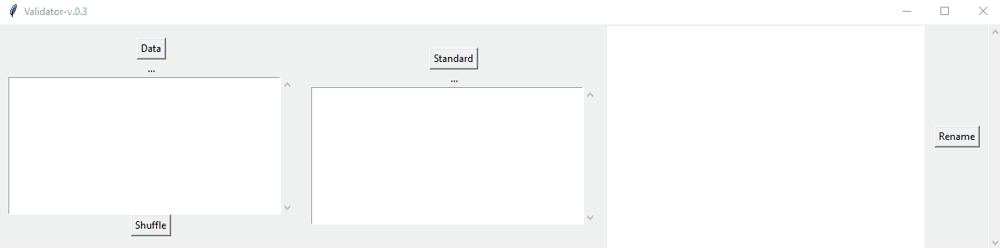
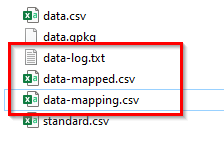

# validator

Validator is a data exploration, validation and restructuration assistant.

## Quick start (in 4 steps)
1. **Launch** validator

		RUN-validator-gui-py2.py # if python2
		RUN-validator-gui-py3.py # if python3

1.  Load your **data**

	

2.  **Shuffle** your data, to explore unique values.

	

- Load your **schema** (first column of the CSV must define the field name)

	

- **Match** the source field names of your data to your target field names

	

> If source and target names are the same, they will be automatically matched (like `id_site` in the above example).

- **Export** the result

	

## Output files

There are 2 output files : 

1. the **restructured** data
- the **2-column data mapping file** with source and target field names

	

## Data formats
Input data format can be either CSV, Geopackage (GPKG) or ESRI Shapefiles (SHP).

## Details
### Shuffle
In the exploration box, only 10 unique values are displayed, but you can shuffle your data to explore more unique values.

### The data mapping file
The data mapping file **keeps track** of your restructuration process. You can use this file in other CLI programs or scripts to restructure other pools of data programmatically.

## Next features
- control data types (integer, float, etc...)
- control regexes (`^[A-Za-z\s\-\u00C0-\u00FF]+$`, etc...)
- CLI Program

## Author & Licence
- Mathieu Rajerison
- Version : v.0.1
- Date : 30th of March 2021
- Licence : Affero-GPL

