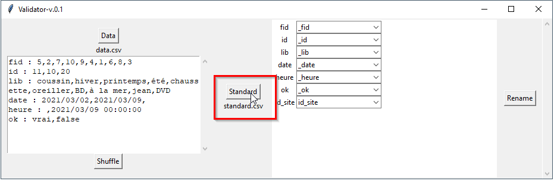

# validator

Validator is a data exploration 🔍, validation ✔️ and restructuration ↔️ assistant.

## 📘 Quick start (in 4️⃣ steps)
**Launch** validator

	RUN-validator-gui-py2.py # if python2
	RUN-validator-gui-py3.py # if python3

1️⃣ Load your **data**

 **Shuffle** your data, to explore unique values.

2️⃣ Load your **schema** (where first column of the CSV defines the field name)

3️⃣ **Match** the source field names of your data to your target field names

> If source and target names are the same, they will be automatically matched (like `id_site` in the above example).

4️⃣ **Export** the result

	

## 📄 Output files

There are 3 output files.

1. the **restructured** data with suffix `-mapped`
2. the **mapping or matching file** with suffix `-mapping` which contains source and target field names

	

3. a **log** `-log` with date time, input data and data schema name, details on schema conformance and data transformation.

	

## 📄 Data formats
Input data format can be either CSV, Geopackage (GPKG) or ESRI Shapefiles (SHP).

## 🔎 Details
### Shuffle
In the exploration box, only 10 unique values are displayed, but you can shuffle your data to explore more unique values.

### The data mapping file
The data mapping file **keeps track** of your restructuration process. You can use this file in other CLI programs or scripts to restructure other pools of data programmatically.

## 🚗 Road map
- control data types (integer, float, etc...)
- control regexes (`^[A-Za-z\s\-\u00C0-\u00FF]+$`, etc...)
- CLI Program

## Author & Licence
- Mathieu Rajerison
- Current version : v-0.2 [(check CHANGELOG for version details)](CHANGELOG.md)
- Date : 30th of March 2021
- Licence : Affero-GPL

